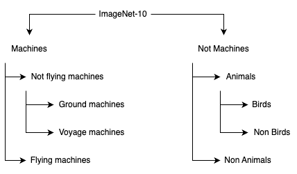
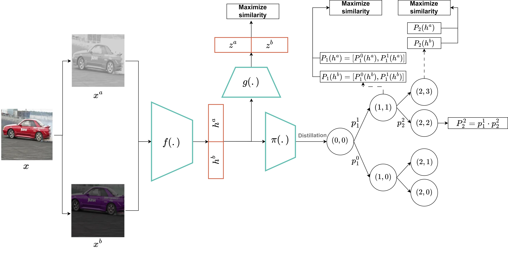
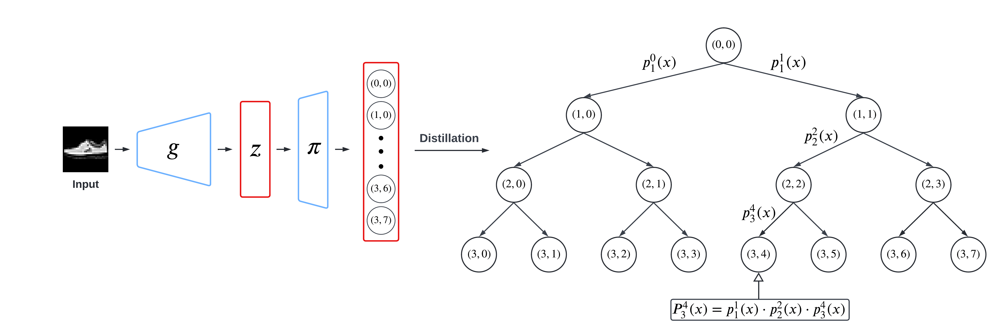
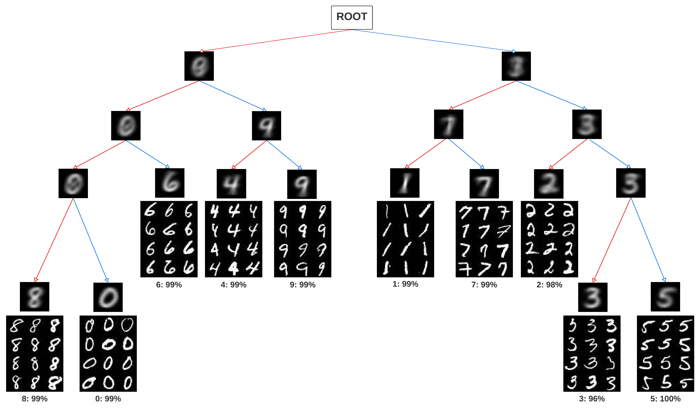
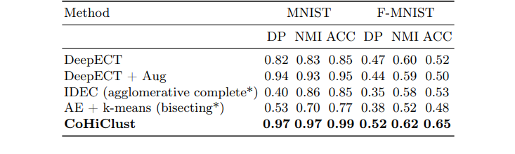
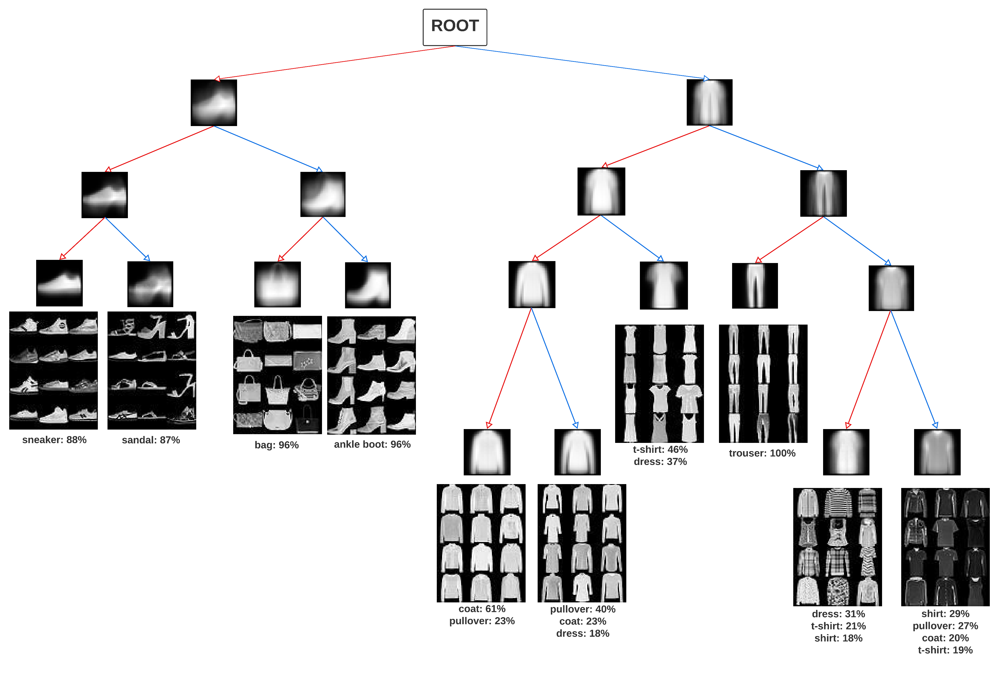
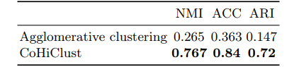
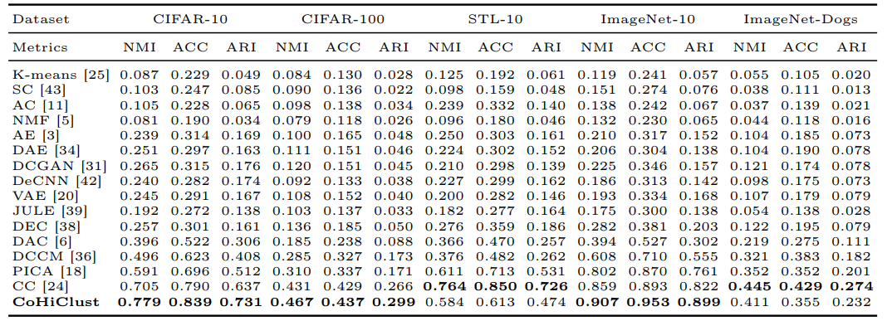
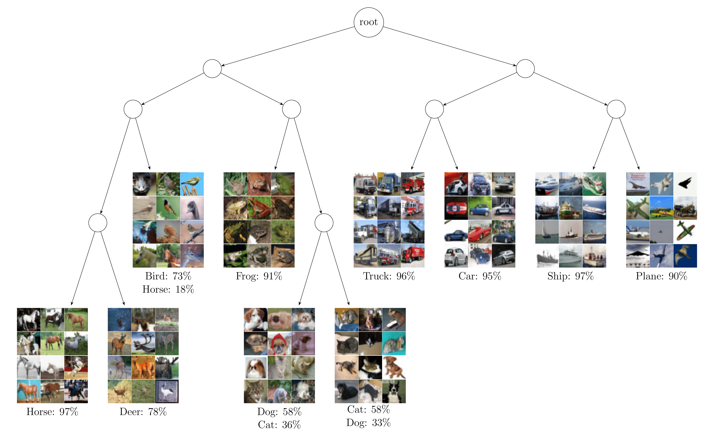

In this post, I would like to introduce you to [CoHiClust](https://arxiv.org/abs/2303.03389), a Contrastive Hierarchical
Clustering model based on deep neural networks, which can be applied
to typical image data.  CoHiClust distills the base network 
into a binary tree without access to any labeled data. 
CoHiClust outperforms the established and popular
Agglomerative Clustering and generates a 
hierarchical structure of clusters consistent with 
human intuition and image semantics. 

You can access the full paper of CoHiClust by clicking [here](https://arxiv.org/abs/2303.03389).

For those who are interested in exploring the code, data, and 
additional resources associated with this study, you can find 
them in my GitHub repository [here](https://github.com/MichalZnalezniak/Contrastive-Hierarchical-Clustering).

# Clustering
Clustering, a fundamental branch of unsupervised learning, 
is often one of the first steps in data analysis, which finds 
applications in anomaly detection [[1](#ref-1)], document clustering [[2](#ref-2)], 
bioinformatins [[3](#ref-3)] and many more. Initial approaches use representations 
taken from pre-trained models [[4](#ref-4), [5](#ref-5)] or employ autoencoders in joint 
training of the representation and the flat clustering model [[6](#ref-6)] or 
hierarchical clustering model [[7](#ref-7)]. 
Recent models designed to image data frequently follow the 
self-supervised learning principle, where the representation 
is trained on pairs of similar images generated automatically by 
data augmentations [[8](#ref-8), [9](#ref-9)]. Since augmentations used for image data 
are class-invariant, the latter techniques of ten obtain a very 
high similarity to the ground truth classes. However, 
we should be careful when comparing clustering techniques 
only by inspecting their accuracy with ground truth classes 
because the objective of clustering is not to perform classification.

## Objective of Clustering
So what’s the objective of clustering then? The primary objective of clustering is to discover structures and patterns in high-dimensional unlabeled data and group together data points with similar patterns. The above procedure reduces the complexity, facilitates the interpretation, and grants important insights into data. Let’s examine how much meaningful information a clustering algorithm can deliver when applied to a subset of the most widely recognized datasets in the field of computer vision and machine learning — ImageNet-10.

*Fig. 1. **Information delivered by hierarchical clustering CoHiClust for ImageNet-10**. 
It is evident that images
with soccer ball are similar to pictures with oranges because of their shapes.
Dogs are more similar to leopards than to penguins, which is reflected in the
constructed hierarchy. The same hold when analyzing the leafs representing cars,
trucks and ships. Looking at the first hierarchy level, we observe a distinction on
the right sub-tree representing machines and left-sub-tree dominated by animals.
Moreover, balls and oranges are separated from the animal branch.*

The algorithm reduces high-dimensional images into a hierarchy of groups that describe images and provides information that summarizes the dataset from high to low-level information.
The hierarchy of groups is consistent with human intuition and image semantics, see Figure 1.

Fig. 2. Super-groups created by clustering algorithm for Image-Net10.

Thanks to the clustering we can understand that ImageNet-10 
consists of two super-groups 
which can be categorazied as 'machines' and 'not machines',
four super-groups which can be catogorazied as 'flying machines',
'not flying machines', 'animals' and 'not animals', see Figure 2.

## Hierarchical clustering
Hierarchical clustering organizes data into a tree-like structure where clusters are nested within each other, while flat clustering forms non-overlapping clusters without any hierarchy.

Hierarchical clustering can provide more detailed information about the relationships between data points, as it captures the hierarchical structure of the data. This can be useful for exploring nested relationships and understanding similarities at different levels of granularity.

Hierarchical clustering groups data based on similarity, forming a hierarchical structure of clusters.
Approaches to hierarchical clustering typically belong to two main groups.

* **Agglomerative**: This is a "bottom-up" approach: Each observation starts in its own cluster, and pairs of clusters are merged as one moves up the hierarchy.
* **Divisive**: This is a "top-down" approach: All observations start in one cluster, and splits are performed recursively as one moves down the hierarchy.

# CoHiClust
CoHiClust by backpropagation, jointly learns deep representation using
SimCLR [[10](#ref-10)] framework and performs hierarchical clustering in a top-down
manner. There are three key components of CoHiClust, see Figure 3.
* The **backbone neural network** $f(.)$ that generates the representation used by 
the hierarchical clustering head.
* The **hierarchical clustering head** $\pi(.)$, which assigns data points to clusters by a 
sequence of decisions.
* The **regularized contrastive loss**, which allows for training the 
whole framework.

Fig. 3: Illustration of main components of CoHiClust.

## Backbone network

CoHiClust utilizes ResNet architectures as its backbone network.
This component projects images into an internal representation, 
which is then utilized by the clustering network. 
CoHiClust can rely on various architecture options.
You can observe how change of backbone network influences the final quality
of clustering in the [full paper](https://arxiv.org/abs/2303.03389).

## Hierarchical clustering head
CoHiClust depends on a soft binary decision tree to create a hierarchical structure, where leaves
play the role of clusters (similar to [[11](#ref-11)]
). In contrast to hard decision trees, every
internal node defines the probability of taking a left/right branch. The final
assignment of the input examples to clusters involves partial decisions made by
the internal nodes. Aggregating these decisions induces the posterior probability
over leaves 

Each inner node is model by one neuron from 
linear layer $\pi(z) = [\sigma (w_1^T z + b_1), \ldots, \sigma (w_K^T z + b_K)]$, 
where $w_n \in \R^N$ and $b_n \in \R$ are 
trainable parameters of $\pi$ and $\sigma$ is sigmoid function.

*Fig. 4: **Illustration of distilling neurnal network into soft decision tree**.
 The output neurons  of the projection head $\pi$ (appended to the base 
network $g$) model decisions made by the internal 
tree nodes. The final assignment of the input example 
to the cluster (leaf node) is performed by aggregating 
edge probabilities located on the path from the root 
to this leaf*

With  $\pi$ output we can define a probability distribution 
of assigning data to clusters on all levels of the tree, see Figure 4

## Loss functions
CoHiClust is trained with hierarchical contrastive loss function
designed for trees - CoHiLoss. CoHiClust builds hierarchical structure by 
maximizing the likelihood that similar data points will 
follow the same path. The more similar data points, the longer
they should be routed through the same nodes. 
Clustering works in unsupervised setting, therefor CoHiClust
uses a self-supervised approach and generates images using data
augmentations (SimCLR).

Consider two data points $x_1, x_2$ with posterior probabilities 
$P_t(x_1), P_t(x_2)$ at level $t$. 
The probability they reach the same node is 
$P_t(x_1) \cdot P_t(x_2) = \sum_{i=0}^{2^t-1} P_t^i(x_1) P_t^i(x_2)$, 
maximal if both are identical one-hot vectors. 
Let's Define the similarity score 
$s_t(x_1,x_2) = \sqrt{P_t(x_1) \cdot P_t(x_2)} = \sum_{i=0}^{2^t-1} \sqrt{P_t^i(x_1) P_t^i(x_2)}$.
Let's aggregate it over all levels of the tree, 
the final similarity function 
is $s(x_1,x_2) = \sum_{t=0}^{T-1} s_t(x_1,x_2)$.

In training, consider a minibatch $ [{x_j}]_{j=1}^N $ and its augmented view $ \tilde{x_j} $. Each $(x_j,\tilde{x}_j)$ pair is treated as positive, maximizing their similarity score to encourage them to share the same leaf node. Other pairs are treated as negative to avoid degenerate solutions, yielding the hierarchical contrastive loss:

$$ CoHiLossNeg = \frac{1}{N(N-1)} \sum_{j=1}^N \sum_{i\neq j} s(x_j,\tilde{x}_{i}) $$

$$ CoHiLossPos = \frac{1}{N} \sum_{j=1}^N s(x_j,\tilde{x}_{j}) $$

$$ CoHiLoss = -CoHiLossNeg + CoHiLossPos $$

Minimizing this loss maximizes the likelihood of similar data points sharing the same path (second term) and minimizes the likelihood of dissimilar ones being grouped together.

# Results
CoHiClust was evaluated on several datasets of color images of 
various resolutions and with a diverse number of classes. 
In addition to reporting similarity scores with ground-truth 
partitions, the constructed hierarchies were analyzed, 
which is equally important in practical use-cases.

To measure the similarity of the constructed partition with 
the ground truth, four widely-used clustering metrics were 
applied: normalized mutual information (NMI), clustering accuracy 
(ACC), adjusted rand index (ARI), and dendrogram purity (DP).

*Fig. 5: **Tree hierarchy constructed for MNIST**. Observe that neighboring
leaves contain images of visually similar classes, e.g. 8 and 0; 4 and 9; 1 and 7.
Such a property holds also for nodes in the upper levels of the tree – the left
sub-tree contain digits with circular shapes, while the digits located in the right
sub-tree consist of lines.*

## Comparison with deep hierarchical clustering methods
In authors knowledge, DeepECT [[7](#ref-7)] is the only hierarchical clustering method based
on deep neural networks. Following their experimental setup, we report the results
on two popular image datasets, MNIST and F-MNIST, and consider classical
hierarchical algorithms evaluated on the latent representation created by the
autoencoder and IDEC [[12](#ref-12)].
The results summarized in Table 1 demonstrate that CoHiClust outperforms
all baselines on both MNIST and F-MNIST datasets in terms of all metrics.
Interestingly, DeepECT benefits from data augmentation in the case of MNIST,
while on F-MNIST it deteriorates its performance. All methods except CoHiClust
and DeepECT failed completely to create a hierarchy recovering true classes (see
the DP measure), which confirms that there is a lack of powerful hierarchical 
clustering methods based on neural networks.

<em>Table 1: Comparison with hierarchical models in terms of DP, NMI and ACC (higher is better).</em>

While examining the MNIST and F-MNIST datasets, 
it's apparent that CoHiClust produces clusters with a 
sensible structure. This structure is in line with our 
expectations and the inherent semantics of the images. 
Figure 5 and Figure 6 provide visual confirmation of this alignment.

*Fig. 6: **Tree hierarchy generated by CoHiClust for F-MNIST** (images
in the nodes denote mean images in each sub-tree). The right sub-tree contains
clothes while the other items (shoes and bags) are placed in the left branch.
Looking at the lowest hierarchy level, we have clothes with long sleeves grouped
in the neighboring leaves. The same holds for clothes with designs. Observe that
CoHiClust assigned white-colored t-shirts and dresses to the same cluster, while
trousers are in the separate one. Small shoes such as sneakers or sandals are
considered similar (neighboring leaves) and distinct from ankle shoes. Concluding,
CoHiClust is able to retrieve meaningful information about image semantics,
which is complementary to the ground truth classification.*

## Comparision with Agglomerative Hierarchical Clustering
The top layer responsible for constructing a decision tree is an 
important component of CoHiClust and cannot be replaced by 
alternative hierarchical clustering methods. 
For this purpose, a backbone network is first trained with a 
typical self-supervised SimCLR technique. Next, agglomerative 
clustering is applied to the resulting representation. 
As seen in Table 2, agglomerative clustering yields very low 
results, indicating that joint optimization of the backbone 
network and clustering tree using the proposed CoHiLoss 
is a significantly better choice. Consequently, 
the representation taken from a typical self-supervised 
learning model does not provide a representation that can 
be clustered accurately using simple methods.

Table 2: Comparison with agglomerative clustering trained on the representation
generated by the self-supervised learning model on CIFAR10.

## Comparision with deep flat clustering methods
CoHiClust was evaluated on typical bemchmark datasets: 
CIFAR10, CIFAR-100, STL-10, ImageNet-Dogs, and ImageNet-10.
The results presented in Table 3 show that CoHiClust outperforms the
comparative methods in 3 out of 5 datasets. It gives extremely good results
on CIFAR-10 and ImageNet-10, but is notably worse than CC on STL-10.
Nevertheless,
one should keep in mind that CoHiClust is the only hierarchical method in this
comparison, and constructing a clustering hierarchy, which resembles ground
truth classes, is more challenging than directly generating a flat partition.

<em>Table 3: Comparison with flat clustering methods on datasets of color images.</em>

When analyzing the CIFAR10 and ImageNet-10 datasets, it becomes 
apparent that CoHiClust generates cluster structures that 
exhibit a high level of coherence, effectively capturing the 
underlying patterns within the data. This observation is 
particularly noteworthy as it aligns closely with our 
intuitive understanding of how these datasets should be 
organized. By examining Figure 1 and Figure 7, we can observe 
how the clusters formed by CoHiClust accurately reflect the 
semantic relationships present in the images, further 
reinforcing the validity of the clustering results.

*Fig. 7: **A tree hierarchy generated by CoHiClust for CIFAR-10**. There is
an evident distinction into animals (left branch) and machines (right branch).
Moreover, all neighbor leaves represent visually similar classes (horses and deers,
dogs and cats, trucks and cars, ships and planes). Images with frogs seem to be
visually similar to cats and dogs, which leads to their placement in the neighbor
leaves (however cats and dogs are connected by a stronger relationship). Interestingly, a small portion of images with horses’ heads are grouped together with
birds because of their similar shapes. Although there is a slight mismatch between
dogs and cats classes, the left leaf contains pets with bright fur photographed in
front, while the right leaf includes animals with dark fur presented from the side,
which coincides with our intuition.*

# Conclusions
CoHiClust a contrastive hierarchical clustering suits
well to clustering of large-scale image databases. The hierarchical structure
constructed by CoHiClust provides significantly more information about the data
than typical flat clustering models. In particular, we can inspect the similarity
between selected groups by measuring their distance in the hierarchy tree and,
in consequence, find super-clusters. Experimental analysis performed on typical
clustering benchmarks confirms that the produced partitions are highly similar
to ground-truth classes. At the same time, CoHiClust allows us to discover
important patterns that have not been encoded in the class labels.

# References 
<a id="ref-1" color="#FFFFFF">[1] Liu, Hongfu, et al. "Clustering with outlier removal." IEEE transactions on knowledge and data engineering 33.6 (2019): 2369-2379.</a> 

<a id="ref-2">[2] Steinbach, Michael, George Karypis, and Vipin Kumar. "A comparison of document clustering techniques." (2000).</a> 

<a id="ref-3">[3] Oyelade, Jelili, et al. "Clustering algorithms: their application to gene expression data." Bioinformatics and Biology insights 10 (2016): BBI-S38316.</a> 

<a id="ref-4">[4] Guérin, J., Gibaru, O., Thiery, S., Nyiri, E.: Cnn features are also great at unsupervised classification. arXiv preprint arXiv:1707.01700 (2017).</a> 

<a id="ref-5">[5] Naumov, S., Yaroslavtsev, G., Avdiukhin, D.: Objective-based hierarchical clustering of deep embedding vectors. In: AAAI. pp. 9055–9063 (2021).</a> 

<a id="ref-6">[6] Guo, X., Gao, L., Liu, X., Yin, J.: Improved deep embedded clustering with local structure preservation. In: Ijcai. pp. 1753–1759 (2017).</a> 

<a id="ref-7">[7] Mautz, D., Plant, C., Böhm, C.: Deep embedded cluster tree. In: 2019 IEEE International Conference on Data Mining (ICDM). pp. 1258–1263. IEEE (2019).</a> 

<a id="ref-8">[8] Li, Y., Hu, P., Liu, Z., Peng, D., Zhou, J.T., Peng, X.: Contrastive clustering.In: Proceedings of the AAAI Conference on Artificial Intelligence. vol. 35, pp. 8547–8555 (2021).</a> 

<a id="ref-9">[9] Dang, Z., Deng, C., Yang, X., Wei, K., Huang, H.: Nearest neighbor matching for deep clustering. In: Proceedings of the IEEE/CVF Conference on Computer Vision and Pattern Recognition. pp. 13693–13702 (2021).</a> 

<a id="ref-10">[10] Chen, T., Kornblith, S., Norouzi, M., Hinton, G.: A simple framework for contrastive learning of visual representations. In: III, H.D., Singh, A. (eds.) Proceedings of the 37th International Conference on Machine Learning. Proceedings of Machine Learning Research, vol. 119, pp. 1597–1607. PMLR (13–18 Jul 2020), https://proceedings.mlr.press/v119/chen20j.html.</a> 

<a id="ref-11">[11] Frosst, N., Hinton, G.: Distilling a neural network into a soft decision tree. arXiv
preprint arXiv:1711.09784 (2017).</a> 

<a id="ref-12">[12] Guo, X., Gao, L., Liu, X., Yin, J.: Improved deep embedded clustering with local
structure preservation. In: Ijcai. pp. 1753–1759 (2017).</a> 
