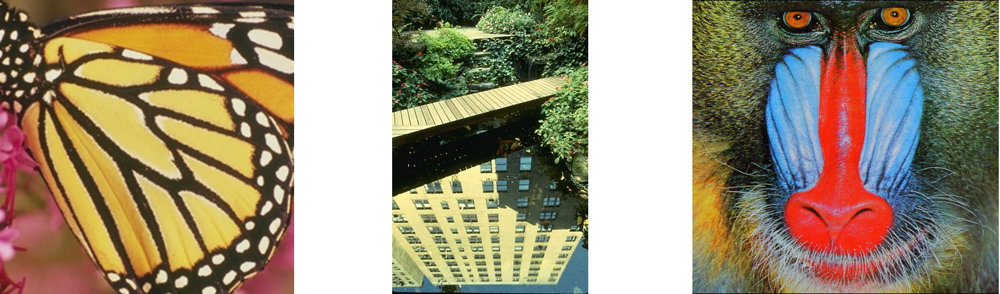
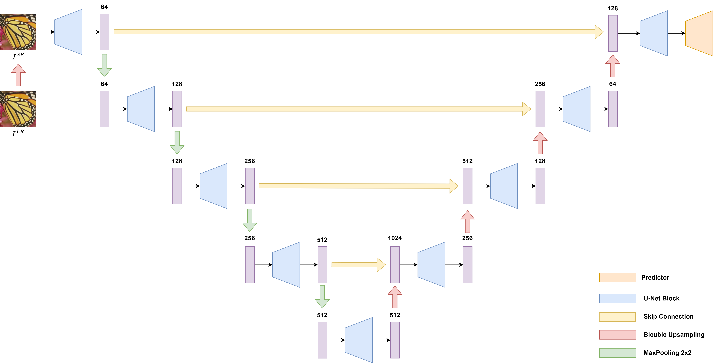
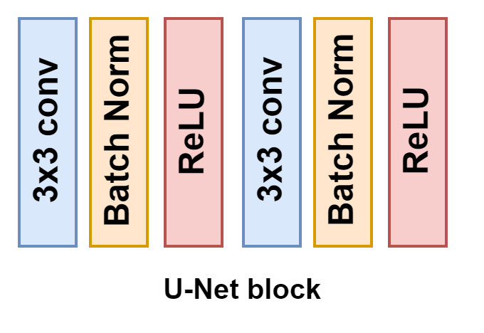
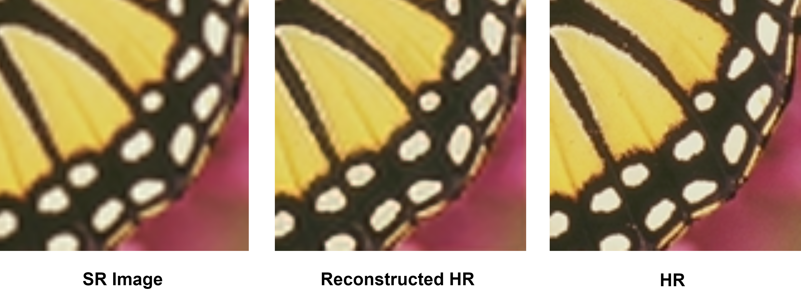
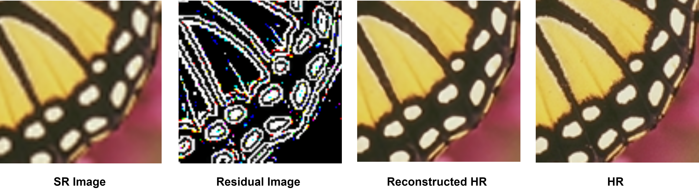
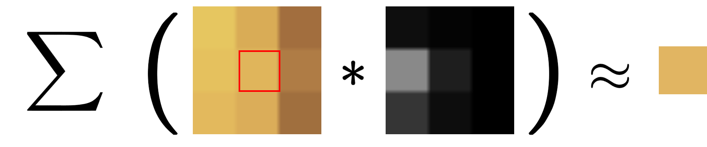
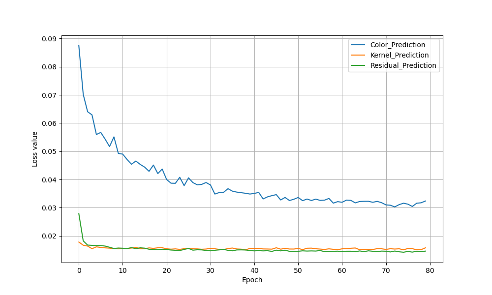

The goal of single-image super-resolution (SISR) is to transform a low-resolution image into a high-resolution version, enhancing both its detail and quality. This process, called upscaling, increases the image's spatial resolution while sharpening and clarifying its visual features.

While the objective remains the same, the methods to achieve SISR can vary. In this post (Part 1), I'll explore three different neural network-based SISR approaches: color prediction, residual prediction, and kernel prediction. But before diving into these methods, it's important to broadly discuss the datasets, neural network architecture, metrics, training parameters and benchmarks used when comparing these approaches.

# Datasets
## Training
For this state of the project, DF2K dataset (DIV2K [[1]](#DIV2k) + Flicker2K [[2]](#Flicker2K)) is used. The dataset consists of 3450 images. The low-resolution images are generated from ground truth images with bicubic downsampling. 

State-of-the-art algorithms are evaluated on three standard upscaling scales: 2x, 3x, and 4x. For this post the model will be trained and evaluated only on a 2x upscaling scale.

## Validation
The performance is measured and compared on three standard benchmark datasets  Set5 [[3]](#SET5), Set14 [[4]](#SET14) and  BSD100 [[5]](#BSD100). Example images from datasets can be seen in Figure 1.

<figcaption>Figure 1: Example ground truth images from the datasets: Set5 (left), BSD100 (middle), and SET14 (right).</figcaption>

# Metrics
In line with SRCNN [[6]](#SRCNN), VDSR [[7]](#VDSR), and other similar methods, PSNR and SSIM metrics were calculated on the luminance component of the image. To ensure consistency with SRCNN and VDSR, a 2-pixel border was excluded from all sides of the image before calculating metrics.

# Network Architecture
At this stage of the project, the basic U-Net architecture [[8]](#U-Net) is employed to extract features. Extracted features are then fed into a Predictor Network ($PN$), which transforms them into an upscaled version of the image. The prediction network differs depending on whether it is predicting color, residual, or kernels. The U-Net network, which functions as a feature extractor ($FN$), is combined with the prediction network ($PN$) to construct the whole model denoted as $N$.

Similar to the SRCNN [[6]](#SRCC), VDSR [[7]](#VDSR), and  DRCN [[9]](#DRCN) networks, the model $N$ aims to learn an end-to-end mapping function $F$ between the bicubic-interpolated low-resolution image $I^{SR}$ and the high-resolution image $I^{HR}$.

In the original U-Net architecture, the decoder phase uses transposed convolution for upsampling. However, the current network architecture differs from the original U-Net, as it utilizes bicubic upscaling instead of transposed convolution, see Figure 2. The basic building block for U-Net architecture can be seen on Figure 3.

<figcaption>Figure 2: U-Net architecture used for this project. The numbers above the features (purple rectangles) correspond to the number of feature channels.</figcaption>

 

<figcaption>Figure 3: The structure of U-Net block.</figcaption>

# Prediction Networks
## Color Prediction
### Introduction
A pioneering method based on neural networks in the field of single image super-resolution that directly predicts color is SRCNN [[6]](#SRCC). The SRCNN model architecture consists of two main components:

* **Feature Extraction**: Two convolutional layers. The first layer uses a kernel size of $9×9$, followed by ReLU activation, and the second layer uses a kernel size of $5×5$.
* **Reconstruction/Prediction Layer**: A convolutional layer with a kernel size of $5×5$ that outputs three channels (RGB).
### Setup
As previously discussed in this stage of the project, the feature extraction ($FE$) component is implemented using the U-Net network. The prediction network ($PN$) outputs three channels with a single convolutional layer using a $1×1$ kernel size, followed by a sigmoid activation function, which constrains the output within a 0-1 range.

For color prediction, $N$ directly reconstructs a high-resolution image $I^{HR}$.

$$ 
N(x) = PN(FE(x)) \approx I^{HR} 
$$

 

<figcaption>Figure 4: Example input, prediction and ground-truth patch from Set5 for color prediction.</figcaption>

## Residual Prediction
### Introduction
Residual prediction was introduced and popularized by VDSR [[7]](#VDSR). In this approach, the model predicts residuals $I^{R}$ (the difference between the high-resolution and low-resolution images) rather than the high-resolution image directly (color prediction).

When the network is trained to predict the entire high-resolution image, as in SRCNN, it must learn both low-frequency $I^{SR}$ and high-frequency information $I^{R}$. Low-frequency information is relatively simple and repetitive but it can still slow down training if the model focuses on learning it [[7]](#VDSR).

Residual learning shifts the network’s focus to learning the more complex high-frequency components that are not present in the low-resolution input. This approach simplifies the learning task and speeds up convergence during the training [[7]](#VDSR).
### Setup

The prediction network ($PN$) outputs three channels with a single convolutional layer using a $1×1$ kernel size.

For residual prediction, $N$ predicts the missing high-frequency details of $I^{SR}$, known as a residual part of the image $I^{R}$. The residual part of the image is defined as $I^{R} = I^{HR} - I^{SR}$, see Figure 5:

$$ 
N(x) = PN(FE(x)) + x \approx I^{HR} 
$$

 

<figcaption>Figure 5: Example input, prediction and ground-truth patch from Set5 for residual prediction.</figcaption>

## Kernel Prediction
### Introduction
The kernel prediction network (KPN) [[10]](#KPN) was introduced to address image denoising, an image restoration problem similar to super-resolution. KPN employs a CNN to estimate local weighting kernels, which are used to compute each denoised pixel based on its neighbors.

For all image restoration problems, including super resolution the kernel prediction network ensures that the final color estimation always remains within the boundary formed by the neighboring pixels in the input image [[10]](#KPN), see Figure 6. 

This significantly reduces the output value search space compared to direct color prediction methods, helping to avoid potential hallucination artifacts.

<figcaption>Figure 6: On the left, pixel <i>p</i> (highlighted in red) and its neighborhood. In the center, the <i>3x3</i> filter predicted for the highlighted pixel. On the right, the super-resolved <i>p</i> after applying filtering.</figcaption>

### Setup 
Kernel prediction uses a single-layer convolutional prediction network ($PN$) that outputs a kernel of scalar weights that is applied to the blurry/low-frequency neighborhood of pixel $p$ to produce super resolved $\tilde p$, see Figure 6. 

Letting $N(p)$ be the $k \times k$ neighborhood centered around pixel $p$ , the final layer for each input pixel outputs kernel $z_{p} \in \mathbb{R}^{k \times k}$. The kernel size $k$ is specified before training along with the other network hyperparameters and the same weights are applied to each RGB color channel. Experiments were conducted with $k=3$

Let's define  $ \left[\mathbf{z}_{p}\right]_q $ as the  q-th entry in the vector obtained by flattening $z_{p}$, Using this, the final normalized kernel weights can be computed as:

$$
w_{p q}=\frac{\exp \left(\left[\mathbf{z}_{p}\right]_q\right)}{\sum_{q^{\prime} \in \mathcal{N}(p)} \exp \left(\left[\mathbf{z}_{p}\right]_{q^{\prime}}\right)}
$$

and the super-resolved pixel $\tilde p$ color as:
$$ 
\tilde p=\sum_{q \in \mathcal{N}(p)} q w_{p q}
$$ 

# Experiments
## Training Parameters
Training is performed using RGB input patches of size $32×32$ extracted from the low-resolution image $I^{LR}$, paired with the corresponding high-resolution patches.

The model is trained with the Adam optimizer by setting $ \beta_{1}=0.9 $,  $ \beta_{2}=0.9 $ and $ \epsilon = 10^{−8}$. 

The minibatch size is set to $16$. The learning rate is initialized as $10^{-3}$ and halved at every 10 epochs.  All models are trained over $80$ epochs. 

For all setups the networks minimize following loss function:
$$ Loss(X,Y) = \frac{1}{n} \sum^{n}_{i=1} \lvert N(X) - Y \rvert $$
$$ Loss(I^{SR}{i}, I^{HR}_{i}) $$

where $n$ is the number of samples in a mini-batch, $I^{HR}$ is ground-truth,and $I^{SR}$ is bicubic-upsampled low-resolution images.

<figcaption>Figure 7: Learning curves on the training set.</figcaption>

## Evaluation of Different Prediction Networks
### Benchmark Results
The quantitative evaluation results of the final models, calculated on public benchmark datasets, are shown in Table 1.

|  Dataset|    Bicubic      | Color Prediction | Residual Prediction |  Kernel Prediction|
|---------|-----------------|------------------|---------------------|-------------------| 
| Set5    | 33.97 / 0.9358  | 33.89 / 0.9407   |  **37.29** / **0.9596**      | 36.66 / 0.9556    |  
| Set14   | 29.74 / 0.8549  | 30.00 / 0.8716   | **31.70**  / **0.8966**      | 31.24 / 0.8843    |  
| BSD100  | 30.32 / 0.8787  | 30.74 / 0.8904   | **32.89**  / **0.9140**       | 32.45 / 0.9045    | 

Table 1: PSNR/SSIM for scale factor $\times 2$ on datasets Set5, Set14, BSD100. **Bold** values indicate the best performance.

The network based on color prediction converges too slowly (see Figure 7) and underperforms compared to both residual prediction and kernel prediction (see Table 1). The slow convergence is due to the fact that the color prediction network does not carry low-frequency information throughout the network.

The residual prediction network yields the best results in terms of metrics, outperforming both color prediction and kernel prediction.

The qualitative results are presented in Figure 8. Models based on residual and kernel prediction successfully reconstruct the detailed textures and lines in the HR images and exhibit better-looking outputs compared to the model with color predction network which fails to reconstruct texture and lines.

 
 

<figcaption>Figure 8: Super-resolution results of Image 20 (BSD100) with scale factor ×2.</figcaption>

## Conclusions
This post compares various prediction networks for single-image super-resolution (SISR). Models based on residual and kernel prediction converge faster and avoid blur artifacts present in upscaled images produced by the color prediction network. The next post will explore methods to improve the convergence speed of color prediction based model by modifying the feature extractor architecture.

## References 
<a id="DIV2k">[1] Lim, Bee, et al. "Enhanced deep residual networks for single image super-resolution." Proceedings of the IEEE conference on computer vision and pattern recognition workshops. 2017.</a> 

<a id="Flicker2K">[2] Agustsson, Eirikur, and Radu Timofte. "Ntire 2017 challenge on single image super-resolution: Dataset and study." Proceedings of the IEEE conference on computer vision and pattern recognition workshops. 2017.</a> 

<a id="SET5">[3] Marco Bevilacqua, Aline Roumy, Christine Guillemot, and
Marie Line Alberi-Morel. Low-complexity single-image super-resolution based on nonnegative neighbor embedding. 2012. 5</a> 

<a id="SET14">[4] Roman Zeyde, Michael Elad, and Matan Protter. On single image scale-up using sparse-representations. In International conference on curves and surfaces, pages 711–730. Springer, 2010</a> 

<a id="BSD100"> [5] David Martin, Charless Fowlkes, Doron Tal, and Jitendra
Malik. A database of human segmented natural images
and its application to evaluating segmentation algorithms and
measuring ecological statistics. In Proceedings Eighth IEEE
International Conference on Computer Vision. ICCV 2001, volume 2, pages 416–423. IEEE, 2001..</a> 

<a id="SRCNN">[6] Dong, Chao, et al. "Image super-resolution using deep convolutional networks." IEEE transactions on pattern analysis and machine intelligence 38.2 (2015): 295-307.</a> 

<a id="VDSRR">[7] Kim, Jiwon, Jung Kwon Lee, and Kyoung Mu Lee. "Accurate image super-resolution using very deep convolutional networks." Proceedings of the IEEE conference on computer vision and pattern recognition. 2016.</a> 

<a id="U-Net">[8] Ronneberger, Olaf, Philipp Fischer, and Thomas Brox. "U-net: Convolutional networks for biomedical image segmentation." Medical image computing and computer-assisted intervention–MICCAI 2015: 18th international conference, Munich, Germany, October 5-9, 2015, proceedings, part III 18. Springer International Publishing, 2015.</a> 

<a id="DRCN"> [9] Kim, Jiwon, Jung Kwon Lee, and Kyoung Mu Lee. "Deeply-recursive convolutional network for image super-resolution." Proceedings of the IEEE conference on computer vision and pattern recognition. 2016.</a>

<a id="KPN"> [10] Bako, Steve, et al. "Kernel-predicting convolutional networks for denoising Monte Carlo renderings." ACM Trans. Graph. 36.4 (2017): 97-1. </a>