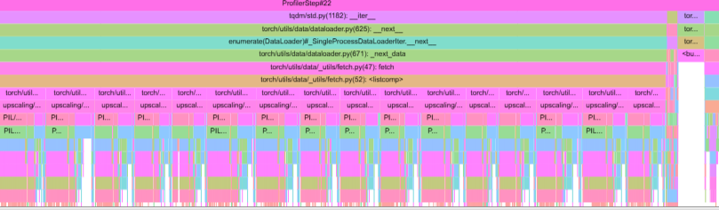
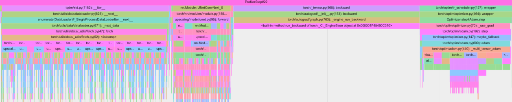
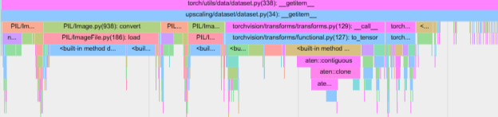
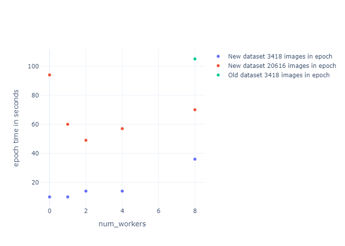

In the [Single Image Super Resolution with various prediction networks](https://michalznalezniak.com/posts/post2/) post, we used DIV2K and Flicker2K dataset for training. Below is a python snippet for both datasets.

```python
from glob import glob
import torch
from torch.utils.data import Dataset
import torchvision
from PIL import Image
import numpy as np

class SuperResolutionDataset(Dataset):
    def __init__(self, dataset_path, dataset_name_HR, dataset_name_LR, scale, name):
        self.name = name
        self.dataset_path = dataset_path
        self.dataset_name_HR = dataset_name_HR
        self.dataset_name_LR = dataset_name_LR
        self.scale = scale
        self.scale_int = int(scale[1])

        self.dataset_path_HR = self.dataset_path + "/" + self.dataset_name_HR
        self.dataset_path_LR = self.dataset_path + "/" + self.dataset_name_LR

        file_list_HR = glob(self.dataset_path_HR + "/*")
        file_list_LR = glob(self.dataset_path_LR + "/*")
        self.data = []
        for hr_file, lr_file in zip(file_list_HR, file_list_LR):
            self.data.append((hr_file, lr_file))

    def __len__(self):
        return len(self.data)

    def __getitem__(self, idx):
        hr_path, lr_path = self.data[idx]

        # Load the image
        hr_image = Image.open(hr_path).convert("RGB")
        lr_image = Image.open(lr_path).convert("RGB")

        hr_image = torchvision.transforms.ToTensor()(hr_image)
        lr_image = torchvision.transforms.ToTensor()(lr_image)
        # Setup the crop top righr corner, height and width for LR
        crop_size_lr = 48
        top_x_lr, top_y_lr = torch.randint(0, (lr_image.shape[1]) - crop_size_lr, (1,)), torch.randint(0, (lr_image.shape[2]) - crop_size_lr, (1,))

        # Setup the crop top righr corner, height and width for HR
        top_x_hr, top_y_hr = self.scale_int * top_x_lr, self.scale_int * top_y_lr
        crop_size_hr = crop_size_lr * self.scale_int

        # Crop the data
        lr_image = lr_image[:, top_x_lr : top_x_lr + crop_size_lr, top_y_lr : top_y_lr + crop_size_lr]
        hr_image = hr_image[:, top_x_hr : top_x_hr + crop_size_hr, top_y_hr : top_y_hr + crop_size_hr]

        return lr_image, hr_image

class Flicker2K(SuperResolutionDataSet):
    pass


class DIV2K(SuperResolutionDataSet):
    pass
```
## Profiling

The `__getitem__()` method for above datasets loads the data and has three main steps:
* Loading full low resolution (LR) and high resolution (HR) images with `PIL.Image.load()`.
* Casting both image objects into pytorch's tensors with `torchvision.transforms.ToTensor()`.
* Cropping the LR and HR tensors into 48x48 and 96x96 patches, respectively.


Let's use the PyTorch profiler to measure the time required to load the data and compare it to the time spent on the forward pass, backward pass and optimizer step. 

The profiler will be run on dataloaders with a batch size of 16 and `num_workers` set to 0.

<p>
<center></center>
<center><b>Figure 1</b>: Profiling step showing execution time for data loading, forward pass, backward pass and optimizer step.</center>
</p>


<div align="center">

| Training Phase        | Time (ms)            | Percentage       |
|-----------------------|----------------------|------------------|
| Data Loading          | 1,603.047            | 92.51%           |
| Forward Pass          | 24.200               | 1.30%            |
| Backward Pass         | 64.505               | 3.70%            |
| Optimizer Step        | 41.063               | 2.30%            |
| **Total**             | **1,732.815**        | **100.00%**      |

**Table 1**: Execution times for each step in milliseconds and their relative percentages.
</div>
<br>

### Pre-patching training data
From Table 1, it is clear that data loading is a bottleneck, significantly impacting the training process. Let's explore potential solutions to speed up data loading.

Since the network is trained on 48x48 patches, we can pre-crop or patch the original images. By doing so, we avoid loading large 2K/4K images and instead work with smaller sections, which should significantly improve data loading efficiency and accelerate training. For this approach, we will pre-patch the images to 128x128 for LR and 256x256 for HR, see Figure 2.

<p>
<center></center>
<center><b>Figure 2</b>: Original 2K/4K image (left) vs. 256x256 pre-patched image (right).</center>
</p>
<br>

Let's rerun the profiler after implementing the process of pre-croping 2K / 4K images into 128x128 / 256x256 patches.

<center></center>
<center><b>Figure 3</b>: Profiling step showing execution time for data loading (pre-cropped), forward pass, backward pass and optimizer step.</center>
<br>


<div align="center">

| Training Phase        | Time (ms)            | Percentage       |
|-----------------------|----------------------|------------------|
| Data Loading          | 74.928               | 36.60%           |
| Forward Pass          | 24.200               | 11.80%           |
| Backward Pass         | 64.505               | 31.50%           |
| Optimizer Step        | 41.063               | 20.00%           |
| **Total**             | **204.696**          | **100.00%**      |

**Table 2**: Execution times for each step in milliseconds and their relative percentages after cropping data.
</div>
<br>

### Moving from `.png` to `.npy`

This is significant improvement (see Table 2), but if we inspect closely we will see that right now `torch.to_tensor` takes a lot of time for the `get_item` method, see Figure 4. 

<center></center>
<center><b>Figure 4</b>: Profiling __getitem__() with .png images.</center>
<br>


Let's save pre cropped/patched images to `.npy` format instead of `.png`, and let's use `numpy.load` instead of `PIL.load`. Let's rerun the profiler.

<div align="center">

| Training Phase        | Time (ms)            |   Percentage     |
|-----------------------|----------------------|------------------|
| Data Loading          | 31.912               | 19.73%           |
| Forward Pass          | 24.200               | 14.96%           |
| Backward Pass         | 64.505               | 39.89%           |
| Optimizer Step        | 41.063               | 25.39%           |
| **Total**             | **161.68**           | **100.00%**      |

**Table 3**: Execution times for each step in milliseconds and their relative percentages, when `PIL.load` is replaced by `numpy.load`.
</div>


### New dataset 
After the changes the code snippet for both datasets looks as following:

```python
class SuperResolutionDataSet(Dataset):
    def __init__(self, dataset_path, dataset_name_HR, dataset_name_LR, scale, num_samples, load_npy, crop_size, name):
        self.name = name
        self.dataset_path = dataset_path
        self.dataset_name_HR = dataset_name_HR
        self.dataset_name_LR = dataset_name_LR
        self.scale = scale
        self.scale_int = int(scale[1])
        self.load_np = load_npy
        self.crop_size_lr = None if crop_size == 'None' else crop_size

        dataset_path_LR = self.dataset_path + "/" + self.dataset_name_LR
        dataset_path_HR = self.dataset_path + "/" + self.dataset_name_HR

        self.data = SuperResolutionDataSet.load_files_to_array(dataset_path_LR, dataset_path_HR)
        self.num_samples = len(self.data) if num_samples == -1 else num_samples


    @staticmethod
    def load_files_to_array(dataset_path_LR, dataset_path_HR):
        file_list_LR = glob(dataset_path_LR + "/*")
        file_list_HR = glob(dataset_path_HR + "/*")
        data = []
        for lr_file, hr_file in zip(file_list_LR, file_list_HR):
            data.append((lr_file, hr_file))
        return data
        
        
    @staticmethod
    def _load_npys(lr_path, hr_path):
            lr_image, hr_image = np.load(lr_path) , np.load(hr_path)
            lr_image, hr_image = torch.from_numpy(lr_image).float(), torch.from_numpy(hr_image).float()
            return lr_image, hr_image
    

    @staticmethod
    def _load_pngs(lr_path, hr_path):
            lr_image, hr_image = Image.open(lr_path).convert("RGB"), Image.open(hr_path).convert("RGB")
            lr_image, hr_image = torchvision.transforms.ToTensor()(lr_image), torchvision.transforms.ToTensor()(hr_image)
            return lr_image, hr_image


    def _crop_data(self, lr_image, hr_image):
        if self.crop_size_lr:

            top_x_lr, top_y_lr = torch.randint(0, (lr_image.shape[1]) - self.crop_size_lr, (1,)), torch.randint(0, (lr_image.shape[2]) - self.crop_size_lr, (1,))

            # Setup the crop top righr corner, height and width for HR
            top_x_hr, top_y_hr = self.scale_int * top_x_lr, self.scale_int * top_y_lr
            crop_size_hr = self.crop_size_lr * self.scale_int

            # Crop the data
            lr_image = lr_image[:, top_x_lr : top_x_lr + self.crop_size_lr, top_y_lr : top_y_lr + self.crop_size_lr]
            hr_image = hr_image[:, top_x_hr : top_x_hr + crop_size_hr, top_y_hr : top_y_hr + crop_size_hr]

        return lr_image, hr_image
    

    def __len__(self):
        return self.num_samples
            

    def __getitem__(self, idx):
        lr_path, hr_path = self.data[idx]
        lr_image, hr_image = SuperResolutionDataSet._load_npys(lr_path, hr_path) if self.load_np else SuperResolutionDataSet._load_pngs(lr_path, hr_path)
        lr_image, hr_image = self._crop_data(lr_image, hr_image)
        return lr_image, hr_image


class Flicker2K(SuperResolutionDataSet):
    pass


class DIV2K(SuperResolutionDataSet):
    pass
```
## Training

By optimizing the data loading process, we reduced one training cycle from `1,732.815 ms` to `161.68 ms`. Finally, let's regress the `num_workers` and see how much training speedup per epoch we will get, after the changes.

<center></center>
<center><b>Figure 5</b>: Comparing epoch time in seconds for the new and the old version of dataset depending on num_workers and number of images used in epoch.</center>
<br>

In Figure 5, we observe that when processing `3,418` images per epoch, the optimal value for `num_workers` is 1, resulting in a training time of 10 seconds per epoch. In comparison, under the previous (old) version of the dataset, processing the same number of images took 105 seconds per epoch.

For the new dataset, when the number of images per epoch is increased from `3,418` to `20,616`, the optimal value for `num_workers` shifts to 2.

## Conclusions
By pre-patching training images and saving them in `.npy` format, we reduced the training time for one epoch by a factor of **10x**, decreasing it from 105 seconds to 10 seconds. This highlights the importance of profiling and optimizing data loading pipelines, enabling faster and more scalable training processes.
